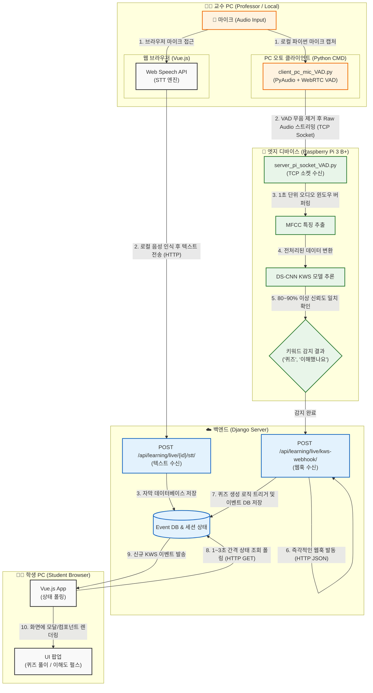

# 🎧 Re:Boot 실시간 오디오 데이터 플로우 (Phase 3 기반)

현재 아키텍처는 **자막/요약을 위한 STT(Speech-to-Text)**와 **키워드 검출을 위한 KWS(Keyword Spotting)**를 위해 마이크 입력이 두 갈래로 나뉘어 처리되는 하이브리드 스트리밍 구조를 띄고 있습니다.

## 오디오 파이프라인 아키텍처 다이어그램 (Flowchart)

## 핵심 요약 (Key Takeaways)

1. **오디오 분리 처리**: 마이크 오디오는 웹 브라우저(STT용)와 로컬 모듈(KWS용)로 이중 캡처됩니다.
2. **트래픽 최적화**: 로컬 모듈의 VAD(Voice Activity Detection)가 침묵을 필터링하여 망 부하를 줄입니다.
3. **엣지 컴퓨팅**: 인퍼런스는 100% 라즈베리 파이 단말기에서 처리되며, 백엔드 서버에는 가벼운 텍스트 웹훅 신호 하나만 전송됩니다.
4. **리얼타임 동기화**: 백엔드에 이벤트가 등록되는 즉시, 모든 클라이언트 창의 다음 폴링 턴(수 초 이내)에 팝업 이벤트 트리거를 전송합니다.
