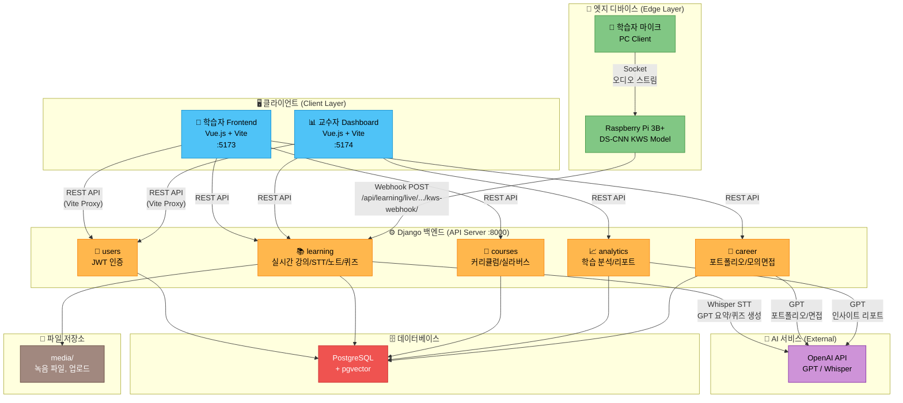
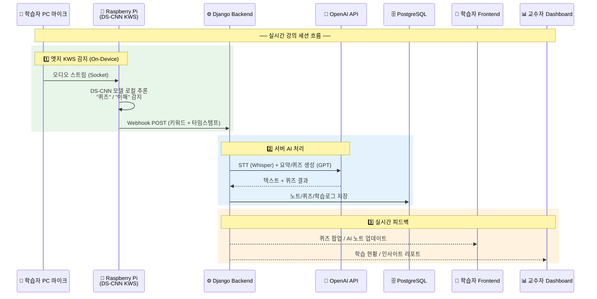
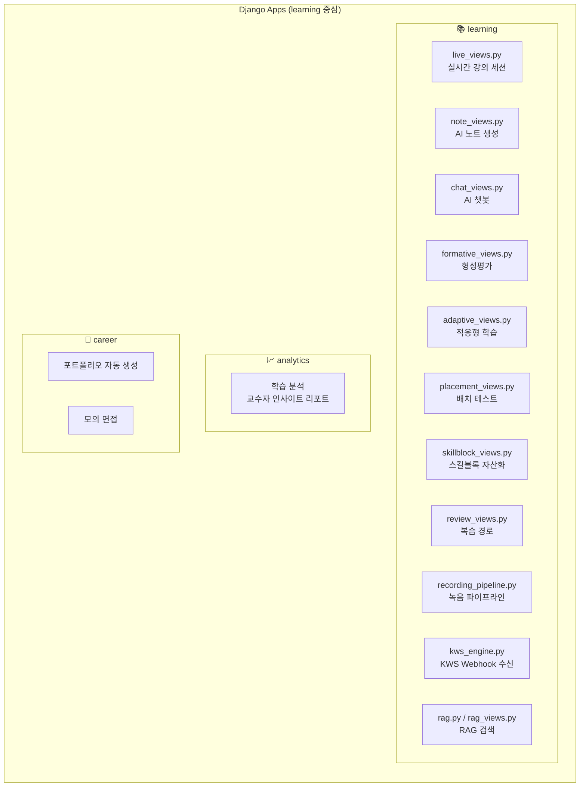

# Re:Boot 프로젝트 전체 아키텍처

## 시스템 아키텍처 (System Architecture)

```mermaid
graph TB
    subgraph Client["🖥️ 클라이언트 (Client Layer)"]
        direction LR
        FE["📱 학습자 Frontend<br/>Vue.js + Vite<br/>:5173"]
        PD["📊 교수자 Dashboard<br/>Vue.js + Vite<br/>:5174"]
    end

    subgraph Edge["🍓 엣지 디바이스 (Edge Layer)"]
        RPI["Raspberry Pi 3B+<br/>DS-CNN KWS Model"]
        MIC["🎤 학습자 마이크<br/>PC Client"]
    end

    subgraph Backend["⚙️ Django 백엔드 (API Server :8000)"]
        direction TB
        AUTH["🔐 users<br/>JWT 인증"]
        LEARN["📚 learning<br/>실시간 강의/STT/노트/퀴즈"]
        COURSE["📖 courses<br/>커리큘럼/실라버스"]
        ANALYTICS["📈 analytics<br/>학습 분석/리포트"]
        CAREER["💼 career<br/>포트폴리오/모의면접"]
    end

    subgraph AI["🤖 AI 서비스 (External)"]
        OPENAI["OpenAI API<br/>GPT / Whisper"]
    end

    subgraph DB["🗄️ 데이터베이스"]
        PG["PostgreSQL<br/>+ pgvector"]
    end

    subgraph Storage["📁 파일 저장소"]
        MEDIA["media/<br/>녹음 파일, 업로드"]
    end

    %% 클라이언트 → 백엔드 연결
    FE -- "REST API<br/>(Vite Proxy)" --> AUTH
    FE -- "REST API" --> LEARN
    FE -- "REST API" --> COURSE
    FE -- "REST API" --> CAREER
    PD -- "REST API<br/>(Vite Proxy)" --> AUTH
    PD -- "REST API" --> LEARN
    PD -- "REST API" --> ANALYTICS

    %% 엣지 → 백엔드 연결
    MIC -- "Socket<br/>오디오 스트림" --> RPI
    RPI -- "Webhook POST<br/>/api/learning/live/.../kws-webhook/" --> LEARN

    %% 백엔드 → 외부 서비스
    LEARN -- "Whisper STT<br/>GPT 요약/퀴즈 생성" --> OPENAI
    CAREER -- "GPT<br/>포트폴리오/면접" --> OPENAI
    ANALYTICS -- "GPT<br/>인사이트 리포트" --> OPENAI

    %% 백엔드 → 데이터
    AUTH --> PG
    LEARN --> PG
    COURSE --> PG
    ANALYTICS --> PG
    CAREER --> PG
    LEARN --> MEDIA

    %% 스타일
    classDef client fill:#4FC3F7,stroke:#0288D1,color:#000
    classDef edge fill:#81C784,stroke:#388E3C,color:#000
    classDef backend fill:#FFB74D,stroke:#F57C00,color:#000
    classDef ai fill:#CE93D8,stroke:#7B1FA2,color:#000
    classDef db fill:#EF5350,stroke:#C62828,color:#fff
    classDef storage fill:#A1887F,stroke:#5D4037,color:#fff

    class FE,PD client
    class RPI,MIC edge
    class AUTH,LEARN,COURSE,ANALYTICS,CAREER backend
    class OPENAI ai
    class PG db
    class MEDIA storage
```

## 데이터 흐름 (Data Flow)

```mermaid
sequenceDiagram
    participant S as 🎤 학습자 PC 마이크
    participant R as 🍓 Raspberry Pi<br/>(DS-CNN KWS)
    participant B as ⚙️ Django Backend
    participant AI as 🤖 OpenAI API
    participant DB as 🗄️ PostgreSQL
    participant F as 📱 학습자 Frontend
    participant P as 📊 교수자 Dashboard

    Note over S,P: ── 실시간 강의 세션 흐름 ──

    rect rgb(232, 245, 233)
        Note over S,R: 1️⃣ 엣지 KWS 감지 (On-Device)
        S->>R: 오디오 스트림 (Socket)
        R->>R: DS-CNN 모델 로컬 추론<br/>"퀴즈" / "이해" 감지
        R->>B: Webhook POST (키워드 + 타임스탬프)
    end

    rect rgb(227, 242, 253)
        Note over B,AI: 2️⃣ 서버 AI 처리
        B->>AI: STT (Whisper) + 요약/퀴즈 생성 (GPT)
        AI-->>B: 텍스트 + 퀴즈 결과
        B->>DB: 노트/퀴즈/학습로그 저장
    end

    rect rgb(255, 243, 224)
        Note over B,P: 3️⃣ 실시간 피드백
        B-->>F: 퀴즈 팝업 / AI 노트 업데이트
        B-->>P: 학습 현황 / 인사이트 리포트
    end
```

## Django 앱 구조 상세

```mermaid
graph LR
    subgraph DjangoApps["Django Apps (learning 중심)"]
        direction TB

        subgraph learning["📚 learning"]
            LV["live_views.py<br/>실시간 강의 세션"]
            NV["note_views.py<br/>AI 노트 생성"]
            CV["chat_views.py<br/>AI 챗봇"]
            FV["formative_views.py<br/>형성평가"]
            AV["adaptive_views.py<br/>적응형 학습"]
            PV["placement_views.py<br/>배치 테스트"]
            SV["skillblock_views.py<br/>스킬블록 자산화"]
            RV["review_views.py<br/>복습 경로"]
            RP["recording_pipeline.py<br/>녹음 파이프라인"]
            KW["kws_engine.py<br/>KWS Webhook 수신"]
            RAG["rag.py / rag_views.py<br/>RAG 검색"]
        end

        subgraph analytics["📈 analytics"]
            AN["학습 분석<br/>교수자 인사이트 리포트"]
        end

        subgraph career["💼 career"]
            PO["포트폴리오 자동 생성"]
            MI["모의 면접"]
        end
    end
```
