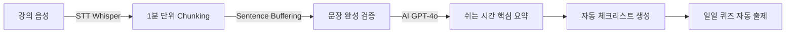
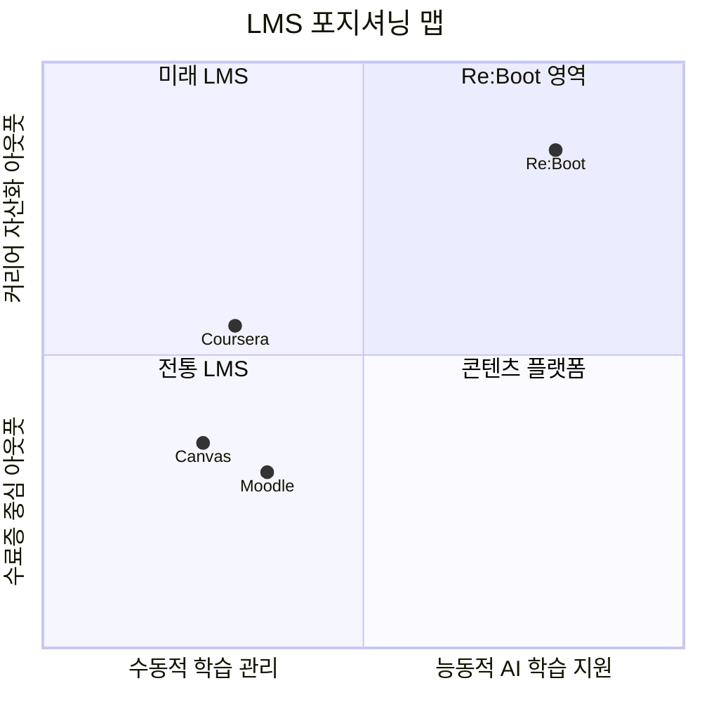

# 🏫 유명 LMS 3대 플랫폼 vs Re:Boot 비교 분석

> **작성일**: 2026-03-13  
> **목적**: 기존 LMS 시장의 대표 플랫폼 3개를 선정하여 특장점을 분석하고, Re:Boot 프로젝트와의 공통점 및 차별점을 도출한다.

---

## 📋 목차

1. [분석 대상 선정 이유](#1-분석-대상-선정-이유)
2. [플랫폼별 특장점 분석](#2-플랫폼별-특장점-분석)
   - [Moodle](#️-moodle)
   - [Canvas LMS](#️-canvas-lms)
   - [Coursera for Campus](#️-coursera-for-campus)
3. [Re:Boot 핵심 기능 요약](#3-reboot-핵심-기능-요약)
4. [공통점 분석](#4-공통점-분석)
5. [차별점 분석](#5-차별점-분석)
6. [종합 포지셔닝 맵](#6-종합-포지셔닝-맵)
7. [전략적 시사점](#7-전략적-시사점)

---

## 1. 분석 대상 선정 이유

| 플랫폼 | 유형 | 선정 이유 |
|:--------|:-----|:----------|
| **Moodle** | 오픈소스 LMS | 전 세계 4억+ 사용자, 교육 기관 표준. 플러그인 생태계 최대 규모 |
| **Canvas LMS** | SaaS 기반 LMS | Instructure 개발, 북미 대학 점유율 1위. 직관적 UX와 모바일 우선 설계 |
| **Coursera for Campus** | MOOC 기반 LMS | 글로벌 Top 대학/기업 콘텐츠 연합. 취업 연계형 학습 모델의 선구자 |

> [!NOTE]
> 세 플랫폼은 각각 **오픈소스 커스터마이징(Moodle)**, **UX 중심 관리형(Canvas)**, **콘텐츠 마켓플레이스형(Coursera)** 이라는 서로 다른 축을 대표하여, Re:Boot의 포지셔닝을 다각도로 조명할 수 있다.

---

## 2. 플랫폼별 특장점 분석

### 🟠 Moodle

| 구분 | 내용 |
|:-----|:-----|
| **운영사** | Moodle Pty Ltd (호주, 오픈소스) |
| **최신 버전** | Moodle 5.0 (2025.04), 5.2 (2026.04 예정) |
| **가격** | 무료 (셀프호스팅) / MoodleCloud 유료 |

#### 핵심 강점

```
✅ 오픈소스 & 무료         — 라이선스 비용 없음, 벤더 종속(Lock-in) 방지
✅ 무한 커스터마이징       — 2,000+ 플러그인, 테마, API 확장 가능
✅ AI 서브시스템 (v5.0)    — OpenAI/Anthropic/Gemini/Ollama 등 멀티 프로바이더 지원
✅ 적응형 학습 경로        — 마이크로러닝, 역할별 평가, 스킬 기반 학습 설계
✅ WCAG 2.2 AA 접근성     — 스크린리더 호환, 포용적 학습 환경
✅ 대규모 확장성           — 수백만 사용자 지원, Moodle Workplace로 기업 교육 대응
```

#### 주요 약점

```
❌ 높은 기술 진입장벽      — 셀프호스팅 시 서버 관리/DB 운영 전문지식 필요
❌ 초기 UI 경험 미흡       — 기본 인터페이스가 현대적 디자인 대비 투박함
❌ 신규 사용자 학습 곡선   — 방대한 기능 옵션으로 인한 초기 혼란
```

---

### 🔵 Canvas LMS

| 구분 | 내용 |
|:-----|:-----|
| **운영사** | Instructure (미국, 상용) |
| **가격** | 기관 단위 유료 구독 (비공개 가격) |
| **점유율** | 북미 고등교육 LMS 시장 1위 |

#### 핵심 강점

```
✅ 직관적 UI/UX            — 교수자 & 학습자 모두 낮은 학습 곡선
✅ SpeedGrader             — 과제/시험 채점 자동화 및 피드백 효율 극대화
✅ 모바일 최우선 설계      — 평점 최상위 모바일 앱, 실시간 알림
✅ LTI 1.3 통합            — 외부 도구 심리스 연동 (Zoom, Turnitin 등)
✅ IgniteAI (2026)         — AI 기반 접근성 자동 수정, 데이터 질의
✅ 차별화 태그             — 특정 학생 그룹에 맞춤 콘텐츠/과제 배정
```

#### 주요 약점

```
❌ 커스터마이징 제한        — 오픈소스 대비 자유도 낮음
❌ 불투명한 가격 정책      — 기관별 협상, 높은 도입 비용
❌ 고급 기능 학습 곡선     — 기본 사용은 쉬우나, 고급 설정은 복잡
❌ 고객 지원 불만          — 응답 속도 느림, 커뮤니티 의존
```

---

### 🟢 Coursera for Campus

| 구분 | 내용 |
|:-----|:-----|
| **운영사** | Coursera Inc. (미국, 상용) |
| **가격** | Freemium + 기관 단위 유료 |
| **특성** | MOOC 콘텐츠 마켓플레이스 + 기관 연계 |

#### 핵심 강점

```
✅ 글로벌 프리미엄 콘텐츠  — Google, IBM, Stanford 등 Top 기관 코스
✅ 취업 직결 자격증        — 전문 자격증(Professional Certificate) 체계
✅ 자기주도 학습           — 비동기/모바일/오프라인 접근 유연성
✅ 실습 프로젝트           — Guided Project로 실무 역량 즉시 적용
✅ 표절 감지 & 프록토링    — Turnitin 연동, 학점 인정 온라인 시험
✅ 저비용 접근성           — 무료 감사(Audit), 장학금 지원
```

#### 주요 약점

```
❌ 낮은 수료율             — 자기주도 학습의 구조적 한계 (동기 부여 부족)
❌ 제한적 강사 상호작용    — 대규모 코스 → 개인 피드백 어려움
❌ 피어 리뷰 품질 불균일   — 동료 평가 의존으로 채점 일관성 저하
❌ 자격증 인정도 편차      — 고용주별/기관별 인식 차이 존재
❌ VR/AR 등 몰입형 기술 부재 — 2026 트렌드 대비 기술 갭
```

---

## 3. Re:Boot 핵심 기능 요약

Re:Boot는 **"어떻게 끝까지 완주시키고 자산화할 것인가"**라는 질문에 데이터로 답하는 커리어 빌드업 플랫폼이다.

| 핵심 모듈 | 설명 |
|:----------|:-----|
| **🎙️ 몰입형 AI 학습 비서** | STT(Whisper Chunking) + OCR로 실시간 자동 필기, 쉬는 시간 AI 요약 생성 |
| **📊 동적 리라우팅 엔진** | 퀴즈 정답률/학습 속도/이탈 기간 분석 → 커리큘럼 자동 수정 (내비게이션 방식) |
| **🧩 스킬 블록 자산화** | 중도 포기 시에도 부분 성취를 데이터 자산으로 보전 |
| **💼 듀얼 아웃풋 포트폴리오** | 취업 모드(역량 포트폴리오) / 창업 모드(MVP 기획서) AI 자동 생성 |
| **👨‍🏫 강사 대시보드** | 학생별 성취도 차트, 이탈 위험군 모니터링, 실라버스 인라인 편집 |
| **🔐 IP 보호 전략** | 원본 음성 미저장 → AI 2차 저작물(요약/체크리스트)만 제공 |
| **🎓 분산형 수강 등록** | 6자리 입장 코드로 강사 주도형 학생 자율 등록 |

---

## 4. 공통점 분석

Re:Boot과 기존 LMS 3개 플랫폼이 **공유하는 설계 철학이나 기능**은 다음과 같다.

### 4.1 역할 기반 접근 제어 (RBAC)

| 플랫폼 | 역할 구분 |
|:--------|:----------|
| Moodle | 관리자, 강사, 학생, 비회원 등 세밀한 역할 커스터마이징 |
| Canvas | 교수자, TA, 학생, 관찰자 등 계층 구조 |
| Coursera | 교수, 학생, 기관 관리자 |
| **Re:Boot** | **학생(Student), 강사(Instructor), 매니저(Manager)** |

> [!TIP]
> Re:Boot의 3단계 역할 구조는 기존 LMS의 핵심 패턴을 따르면서 **부트캠프 운영 구조(강사-매니저 이중 관리)**에 맞게 최적화되어 있다.

### 4.2 AI 기반 학습 지원

| 기능 | Moodle 5.0 | Canvas (IgniteAI) | Coursera | **Re:Boot** |
|:-----|:-----------|:-------------------|:---------|:------------|
| AI 콘텐츠 생성 | ✅ 퀴즈/설명 생성 | ✅ Alt 텍스트 자동화 | ❌ | ✅ **요약/퀴즈/체크리스트 자동 생성** |
| 예측 분석 | ✅ 위험 학생 도출 | 🔄 개발 중 | ❌ | ✅ **골든타임 알림 + 이탈 예측** |
| 적응형 학습 | ✅ 경로 기반 | ❌ | ❌ | ✅ **동적 리라우팅 (내비게이션 방식)** |

### 4.3 평가 시스템

모든 플랫폼이 **퀴즈/시험 → 채점 → 성취도 기록**의 기본 파이프라인을 공유한다.

| 기능 | Moodle | Canvas | Coursera | **Re:Boot** |
|:-----|:-------|:-------|:---------|:------------|
| 퀴즈 출제 | ✅ 수동 | ✅ 수동/자동 | ✅ 수동 | ✅ **AI 자동 출제 (당일 학습 기반)** |
| 실시간 채점 | ✅ | ✅ SpeedGrader | ✅ | ✅ 즉시 채점 + 해설 |
| 성취도 대시보드 | ✅ | ✅ | ✅ | ✅ **학생/강사/매니저 3중 시점** |

### 4.4 모바일 접근성

| 플랫폼 | 모바일 지원 |
|:--------|:------------|
| Moodle | 전용 앱 (오프라인 지원) |
| Canvas | 평점 최상위 앱 |
| Coursera | 모바일/오프라인 학습 |
| **Re:Boot** | **웹 기반 반응형 (Vue.js)** — 앱 추가 확장 가능 |

### 4.5 강사/관리자 대시보드

네 플랫폼 모두 **교수자/관리자 전용 관제 화면**을 제공하며, 학생별 진도율 및 성취도를 시각화한다.

---

## 5. 차별점 분석

Re:Boot이 기존 LMS 대비 **고유하게 보유한 기능이나 설계 철학**을 분석한다.

### 5.1 실시간 STT 기반 자동 필기 — ⭐ 핵심 차별점



| 구분 | 기존 LMS (Moodle/Canvas/Coursera) | **Re:Boot** |
|:-----|:-----------------------------------|:------------|
| **강의 중 노트** | 학생이 직접 필기 | **AI가 실시간 대행** (인지 부하 해소) |
| **요약 생성** | 수업 후 수동 정리 | **쉬는 시간 자동 요약** (즉시 피드백) |
| **Data 원천** | 교수자가 업로드한 자료 | **강의 음성의 실시간 변환** |

> [!IMPORTANT]
> 기존 LMS는 모두 **"교수자가 올린 콘텐츠를 학생이 소비하는"** 모델이다.  
> Re:Boot은 **"강의 현장의 음성 데이터를 실시간으로 캡처하여 AI가 가공하는"** 모델로, 데이터 생산의 방향 자체가 다르다.

### 5.2 동적 리라우팅 (Dynamic Re-routing) — ⭐ 핵심 차별점

| 구분 | 기존 LMS | **Re:Boot** |
|:-----|:---------|:------------|
| **진도 관리** | 정적 (미이수 시 심리적 부채 누적) | **동적 경로 재설계** (내비게이션 방식) |
| **이탈 대응** | 알림/독촉 | **압축 복구 플랜** 자동 가동 |
| **교육 철학** | "정해진 커리큘럼 완주" 강제 | **"현재 시점 최적 경로"** 유연 제안 |

Moodle의 적응형 학습 경로가 가장 유사하나, 이는 **교수자가 사전 설계한 분기 조건** 기반이다. Re:Boot의 리라우팅은 **학습자의 실시간 데이터(퀴즈 정답률, 학습 속도, 이탈 기간)**를 AI가 분석하여 **자동으로 커리큘럼을 수정**한다는 점에서 근본적으로 다르다.

### 5.3 스킬 블록 자산화 — ⭐ 핵심 차별점

| 구분 | 기존 LMS | **Re:Boot** |
|:-----|:---------|:------------|
| **성취 정의** | 수료증 (All or Nothing) | **스킬 블록** (부분 성취의 데이터 자산) |
| **중도 포기 시** | "실패" 처리 (기록 소실) | **"부분적 성취"** 보존 및 시각화 |
| **재사용성** | 수료증 첨부 | **포트폴리오/MVP 기획서로 변환** |

> [!WARNING]
> 기존 LMS 생태계의 가장 큰 구조적 문제는 **"중도 이탈 = 모든 경험의 소실"**이다.  
> 부트캠프 중도 탈락률이 **15-30%** 수준인 현실에서, 이 학습 데이터의 자산화는 국가 교육 예산 효율화와도 직결된다.

### 5.4 듀얼 아웃풋 포트폴리오 (취업 + 창업) — ⭐ 핵심 차별점

| 구분 | 기존 LMS | **Re:Boot** |
|:-----|:---------|:------------|
| **아웃풋** | 수료증, 성적표 | **AI 포트폴리오 + MVP 기획서** |
| **커리어 연계** | 채용 링크/추천 | **학습 로그 → 역량 키워드 자동 추출** |
| **방향성** | 학습 "관리" | **학습의 "자산화"** |

Coursera의 Professional Certificate가 가장 유사하지만, 이는 **플랫폼이 사전 설계한 고정 자격증**이다. Re:Boot은 **학습자 개인의 실제 학습 데이터**를 기반으로 취업/창업 목적별 맞춤 포트폴리오를 AI가 조합한다.

### 5.5 강사 IP 보호 전략

| 구분 | 기존 LMS | **Re:Boot** |
|:-----|:---------|:------------|
| **강의 녹화** | 전체 녹화/배포 (IP 노출) | **원본 음성 미저장** |
| **학습 자료** | 원본 그대로 배포 | **AI 2차 저작물**(요약/체크리스트)만 제공 |
| **강사 가치** | 단순 콘텐츠 공급자 | **데이터 피드백 수신자** (강의 개선 인사이트) |

### 5.6 기능별 종합 비교표

| 기능 | Moodle | Canvas | Coursera | **Re:Boot** |
|:-----|:------:|:------:|:--------:|:-----------:|
| 실시간 STT 자동 필기 | ❌ | ❌ | ❌ | ✅ |
| AI 쉬는 시간 요약 | ❌ | ❌ | ❌ | ✅ |
| 동적 커리큘럼 리라우팅 | 🔶 교수자 설계 | ❌ | ❌ | ✅ AI 자동 |
| AI 퀴즈 자동 출제 | 🔶 v5.0~ | ❌ | ❌ | ✅ 당일 학습 기반 |
| 스킬 블록 (부분 성취) | ❌ | ❌ | ❌ | ✅ |
| 듀얼 포트폴리오 | ❌ | ❌ | 🔶 자격증 | ✅ 취업+창업 |
| 강사 IP 보호 | ❌ | ❌ | ❌ | ✅ |
| 이탈 예측 & 골든타임 알림 | 🔶 AI 분석 | 🔄 개발 중 | ❌ | ✅ |
| 입장 코드 기반 등록 | 🔶 플러그인 | ❌ | ❌ | ✅ 내장 |
| 오프라인 강의 지원 | ❌ | ❌ | 🔶 오프라인 DL | ✅ 유니버설 캡처 |
| RBAC | ✅ | ✅ | ✅ | ✅ |
| 모바일 앱 | ✅ | ✅ | ✅ | 🔶 웹 반응형 |
| 오픈소스 | ✅ | ❌ | ❌ | 🔶 비공개 |
| 대규모 콘텐츠 라이브러리 | 🔶 커뮤니티 | ❌ | ✅ | ❌ |

> ✅ 완전 지원 &nbsp;&nbsp; 🔶 부분 지원/조건부 &nbsp;&nbsp; 🔄 개발 중 &nbsp;&nbsp; ❌ 미지원

---

## 6. 종합 포지셔닝 맵



### 포지셔닝 해석

| 영역 | 특성 |  해당 플랫폼 |
|:-----|:-----|:-------------|
| **전통 LMS** (3사분면) | 수동적 관리 + 수료증 중심 | Moodle, Canvas |
| **콘텐츠 플랫폼** (4사분면) | 수동적 관리 + 커리어 연계 | Coursera |
| **Re:Boot 영역** (1사분면) | **능동적 AI 지원 + 커리어 자산화** | **Re:Boot** |

---

## 7. 전략적 시사점

### 7.1 Re:Boot의 경쟁 우위 (Competitive Moat)

| 우위 요소 | 설명 | 방어 가능성 |
|:----------|:-----|:----------:|
| **실시간 STT → AI 요약 파이프라인** | 강의 현장 데이터 실시간 캡처 + 가공 | ⭐⭐⭐ 높음 (기술적 진입장벽) |
| **동적 리라우팅 알고리즘** | 학습 데이터 기반 자동 커리큘럼 수정 | ⭐⭐⭐ 높음 (데이터 종속성) |
| **스킬 블록 자산화** | 부분 성취의 데이터 보전 패러다임 | ⭐⭐ 중간 (개념은 모방 가능) |
| **강사 IP 보호 모델** | 원본 미저장 + 2차 저작물 방식 | ⭐⭐⭐ 높음 (법적 설계) |

### 7.2 보완이 필요한 영역

> [!CAUTION]
> 기존 LMS 대비 Re:Boot이 아직 취약한 영역도 인지해야 한다.

| 영역 | 기존 LMS 수준 | Re:Boot 현황 | 권장 방향 |
|:-----|:-------------|:-------------|:----------|
| **모바일 전용 앱** | Moodle/Canvas 전용 앱 보유 | 웹 반응형만 지원 | PWA 또는 네이티브 앱 고려 |
| **콘텐츠 라이브러리** | Coursera 7,000+ 코스 | 교수자 업로드 의존 | B2B 기관 연계 콘텐츠 확보 |
| **대규모 확장성 검증** | Moodle 수백만 유저 | 소규모 MVP 단계 | 부하 테스트 및 인프라 설계 |
| **접근성 (WCAG)** | Moodle WCAG 2.2 AA 준수 | 미검증 | 접근성 감사 필요 |
| **플러그인/통합 생태계** | Moodle 2,000+ 플러그인 | 독자 시스템 | 외부 LTI 연동 표준 검토 |

### 7.3 핵심 메시지 (Elevator Pitch)

> **"Moodle은 '어떻게 가르칠 것인가'를, Canvas는 '어떻게 관리할 것인가'를, Coursera는 '무엇을 가르칠 것인가'를 고민합니다.**  
> **Re:Boot는 '어떻게 끝까지 완주시키고, 그 경험을 커리어 자산으로 전환할 것인가'를 데이터와 AI로 답하는 유일한 플랫폼입니다."**

---

> **분석 근거**: Moodle 5.0 공식 릴리스 (2025.04), Canvas 로드맵 (Instructure 2025-2026), Coursera for Campus 공식 문서, Re:Boot KI 아티팩트 및 프로젝트 소스코드 기반
