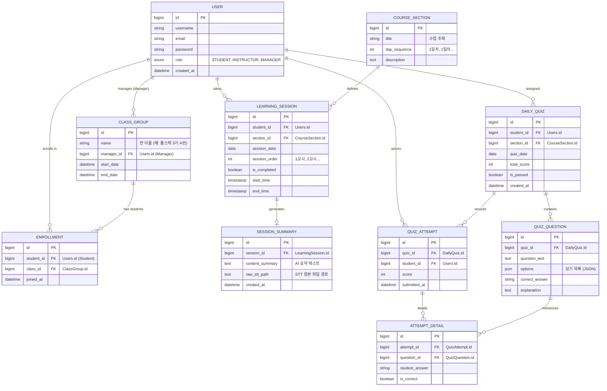

# Re:Boot 서비스 ERD (Entity Relationship Diagram)

이 문서는 Re:Boot 서비스의 데이터베이스 스키마 구조를 정의합니다.
**MariaDB**를 기준으로 설계되었으며, 사용자의 학습 흐름(세션 -> 요약 -> 퀴즈 -> 평가)을 중심으로 관계가 형성되어 있습니다.

## 1. Mermaid ER Diagram

## 2. 테이블 상세 설명

### A. 회원 및 조직 (User & Organization)

| Table           | 설명                                  | 비고                           |
| :-------------- | :------------------------------------ | :----------------------------- |
| **USER**        | 모든 사용자 정보 (학생, 강사, 매니저) | `role` 필드로 권한 구분        |
| **CLASS_GROUP** | 반(Class) 정보                        | 매니저 1명이 담당              |
| **ENROLLMENT**  | 학생과 반의 N:M 관계 매핑             | 학생이 어느 반에 속했는지 기록 |

### B. 학습 흐름 (Learning Flow)

| Table                | 설명                                         | 비고                       |
| :------------------- | :------------------------------------------- | :------------------------- |
| **COURSE_SECTION**   | 정규 커리큘럼의 하루 단위 수업 정보          | 예: "Python 기초 (1일차)"  |
| **LEARNING_SESSION** | 학생별 실제 학습 기록 (교시 단위)            | 실시간 STT가 발생하는 단위 |
| **SESSION_SUMMARY**  | **[핵심]** 매 교시 쉬는 시간 생성되는 요약본 | 퀴즈 생성의 Source Data    |

### C. 평가 시스템 (Assessment System)

| Table              | 설명                                 | 비고                                    |
| :----------------- | :----------------------------------- | :-------------------------------------- |
| **DAILY_QUIZ**     | 하루 수업 종료 후 생성되는 퀴즈 세트 | `SessionSummary` 데이터를 기반으로 생성 |
| **QUIZ_QUESTION**  | 개별 문제 (5문제)                    | 객관식 보기 및 정답 포함                |
| **QUIZ_ATTEMPT**   | 학생의 퀴즈 응시 결과 헤더           | 총점 저장                               |
| **ATTEMPT_DETAIL** | 문항별 정답/오답 상세 기록           | 오답 노트 및 취약점 분석용              |
