# Re:Boot 서비스 ERD (Entity Relationship Diagram)

이 문서는 Re:Boot 서비스의 데이터베이스 스키마 구조를 정의합니다.
**MariaDB**를 기준으로 설계되었으며, 사용자의 학습 흐름(세션 -> 요약 -> 퀴즈 -> 평가)과 커리어 지원(포트폴리오 -> 모의면접)을 중심으로 관계가 형성되어 있습니다.

> **Updated**: 2026-02-19 — 멘토링 피드백 반영 (모의면접/포트폴리오/강의 테이블 추가)

## 1. Mermaid ER Diagram

```mermaid
erDiagram
    %% ──────────────────────────────────────────
    %% 사용자 및 그룹 관리
    %% ──────────────────────────────────────────
    USER {
        bigint id PK
        string username
        string email
        string password
        enum role "STUDENT, INSTRUCTOR, MANAGER"
        string goal_type "취업, 창업 등"
        datetime created_at
    }

    CLASS_GROUP {
        bigint id PK
        string name "반 이름 (예: 풀스택 3기 A반)"
        bigint manager_id FK "Users.id (Manager)"
        datetime start_date
        datetime end_date
    }

    ENROLLMENT {
        bigint id PK
        bigint student_id FK "Users.id (Student)"
        bigint class_id FK "ClassGroup.id"
        datetime joined_at
    }

    LECTURE {
        bigint id PK
        string title "클래스/강의명"
        bigint instructor_id FK "Users.id (Instructor)"
        string access_code "6자리 입장 코드"
        datetime created_at
    }

    STUDENT_LECTURE {
        bigint student_id FK "Users.id"
        bigint lecture_id FK "Lecture.id"
    }

    %% ──────────────────────────────────────────
    %% 커리큘럼 및 학습 세션 관리
    %% ──────────────────────────────────────────
    COURSE_SECTION {
        bigint id PK
        string title "수업 주제"
        int day_sequence "1일차, 2일차..."
        text description
    }

    SYLLABUS {
        bigint id PK
        bigint lecture_id FK "Lecture.id"
        int week_number "주차 (1, 2, ...)"
        string title "주차별 주제"
        text description
    }

    LEARNING_OBJECTIVE {
        bigint id PK
        bigint syllabus_id FK "Syllabus.id"
        string content "학습 목표/체크리스트 항목"
        int order "정렬 순서"
    }

    STUDENT_CHECKLIST {
        bigint id PK
        bigint student_id FK "Users.id"
        bigint objective_id FK "LearningObjective.id"
        boolean is_checked
        datetime updated_at
    }

    LEARNING_SESSION {
        bigint id PK
        bigint student_id FK "Users.id"
        bigint lecture_id FK "Lecture.id"
        bigint section_id FK "CourseSection.id"
        date session_date
        int session_order "1교시, 2교시..."
        boolean is_completed
        timestamp start_time
        timestamp end_time
        string youtube_url "영상 학습 URL"
        text context_summary "대화 압축 요약본"
    }

    STT_LOG {
        bigint id PK
        bigint session_id FK "LearningSession.id"
        int sequence_order "순서"
        text text_chunk "STT 변환 조각"
        datetime created_at
    }

    %% ──────────────────────────────────────────
    %% AI 요약 및 데이터 자산
    %% ──────────────────────────────────────────
    SESSION_SUMMARY {
        bigint id PK
        bigint session_id FK "LearningSession.id"
        text content_summary "AI 요약 텍스트"
        text raw_stt_link "STT 원본 파일 경로"
        datetime created_at
    }

    VECTOR_STORE {
        bigint id PK
        text content "원본 텍스트 청크"
        vector embedding "1536-dim 임베딩 벡터"
        bigint session_id FK "LearningSession.id"
        bigint lecture_id FK "Lecture.id"
        string source_type "stt, summary, material"
        datetime created_at
    }

    %% ──────────────────────────────────────────
    %% 퀴즈 및 평가
    %% ──────────────────────────────────────────
    DAILY_QUIZ {
        bigint id PK
        bigint student_id FK "Users.id"
        bigint section_id FK "CourseSection.id"
        date quiz_date
        int total_score
        boolean is_passed
        datetime created_at
    }

    QUIZ_QUESTION {
        bigint id PK
        bigint quiz_id FK "DailyQuiz.id"
        text question_text
        json options "보기 목록 (JSON)"
        string correct_answer
        text explanation
    }

    QUIZ_ATTEMPT {
        bigint id PK
        bigint quiz_id FK "DailyQuiz.id"
        bigint student_id FK "Users.id"
        int score
        text review_note "AI 오답노트 및 학습 가이드"
        datetime submitted_at
    }

    ATTEMPT_DETAIL {
        bigint id PK
        bigint attempt_id FK "QuizAttempt.id"
        bigint question_id FK "QuizQuestion.id"
        string student_answer
        boolean is_correct
    }

    %% ──────────────────────────────────────────
    %% 커리어 지원 (포트폴리오 + 모의면접)
    %% ──────────────────────────────────────────
    PORTFOLIO {
        bigint id PK
        bigint student_id FK "Users.id"
        enum portfolio_type "JOB, STARTUP"
        string title "포트폴리오 제목"
        text content "Markdown 형식 내용"
        datetime created_at
    }

    MOCK_INTERVIEW {
        bigint id PK
        bigint student_id FK "Users.id"
        bigint portfolio_id FK "Portfolio.id"
        enum persona "TECH_LEAD, FRIENDLY_SENIOR, HR_MANAGER, STARTUP_CEO, BIG_TECH, PRESSURE"
        enum status "IN_PROGRESS, COMPLETED"
        datetime created_at
    }

    INTERVIEW_EXCHANGE {
        bigint id PK
        bigint interview_id FK "MockInterview.id"
        text question "AI 면접 질문"
        text answer "사용자 답변"
        text feedback "AI 피드백 및 평가"
        int score "답변 점수 (0~100)"
        int order "질문 순서"
        datetime created_at
    }

    %% ──────────────────────────────────────────
    %% 관계 정의
    %% ──────────────────────────────────────────

    %% 사용자-조직
    USER ||--o{ ENROLLMENT : "enrolls in"
    CLASS_GROUP ||--o{ ENROLLMENT : "has students"
    USER ||--o{ CLASS_GROUP : "manages (Manager)"

    %% 강의-수강
    USER ||--o{ LECTURE : "teaches (Instructor)"
    USER ||--o{ STUDENT_LECTURE : "enrolled in"
    LECTURE ||--o{ STUDENT_LECTURE : "contains"

    %% 커리큘럼
    LECTURE ||--o{ SYLLABUS : "has syllabus"
    SYLLABUS ||--o{ LEARNING_OBJECTIVE : "defines objectives"
    USER ||--o{ STUDENT_CHECKLIST : "checks"
    LEARNING_OBJECTIVE ||--o{ STUDENT_CHECKLIST : "tracked by"

    %% 학습
    USER ||--o{ LEARNING_SESSION : "takes"
    LECTURE ||--o{ LEARNING_SESSION : "collects"
    COURSE_SECTION ||--o{ LEARNING_SESSION : "defines"
    LEARNING_SESSION ||--o{ STT_LOG : "generates chunks"
    LEARNING_SESSION ||--o| SESSION_SUMMARY : "generates summary"
    LEARNING_SESSION ||--o{ VECTOR_STORE : "embeds"
    LECTURE ||--o{ VECTOR_STORE : "indexes"

    %% 평가
    USER ||--o{ DAILY_QUIZ : "assigned"
    DAILY_QUIZ ||--o{ QUIZ_QUESTION : "contains"
    USER ||--o{ QUIZ_ATTEMPT : "solves"
    DAILY_QUIZ ||--o{ QUIZ_ATTEMPT : "records"
    QUIZ_ATTEMPT ||--o{ ATTEMPT_DETAIL : "details"
    QUIZ_QUESTION ||--o{ ATTEMPT_DETAIL : "references"

    %% 커리어
    USER ||--o{ PORTFOLIO : "creates"
    USER ||--o{ MOCK_INTERVIEW : "takes interview"
    PORTFOLIO ||--o{ MOCK_INTERVIEW : "basis for"
    MOCK_INTERVIEW ||--o{ INTERVIEW_EXCHANGE : "contains Q&A"
```

## 2. 테이블 상세 설명

### A. 회원 및 조직 (User & Organization)

| Table               | 설명                                  | 비고                                       |
| :------------------ | :------------------------------------ | :----------------------------------------- |
| **USER**            | 모든 사용자 정보 (학생, 강사, 매니저) | `role` 필드로 권한 구분                    |
| **CLASS_GROUP**     | 반(Class) 정보                        | 매니저 1명이 담당                          |
| **ENROLLMENT**      | 학생과 반의 N:M 관계 매핑             | 학생이 어느 반에 속했는지 기록             |
| **LECTURE**         | 강사가 개설한 강의(클래스)            | 6자리 입장 코드(`access_code`)로 수강 등록 |
| **STUDENT_LECTURE** | 학생과 강의의 N:M 관계                | 분산형 수강 등록 시스템의 핵심             |

### B. 커리큘럼 관리 (Curriculum)

| Table                  | 설명                        | 비고                  |
| :--------------------- | :-------------------------- | :-------------------- |
| **SYLLABUS**           | 강의별 주차 계획서          | 강사가 관리           |
| **LEARNING_OBJECTIVE** | 주차별 학습 목표/체크리스트 | 학생 진도 추적의 기준 |
| **STUDENT_CHECKLIST**  | 학생별 학습 목표 완료 여부  | 스킬 블록 획득 시스템 |

### C. 학습 흐름 (Learning Flow)

| Table                | 설명                                          | 비고                                     |
| :------------------- | :-------------------------------------------- | :--------------------------------------- |
| **COURSE_SECTION**   | 정규 커리큘럼의 하루 단위 수업 정보           | 예: "Python 기초 (1일차)"                |
| **LEARNING_SESSION** | 학생별 실제 학습 기록 (교시 단위)             | 실시간 STT가 발생하는 단위               |
| **STT_LOG**          | 장시간 녹음 안정성을 위한 **Chunking** 데이터 | 1분 단위 조각 저장                       |
| **SESSION_SUMMARY**  | **[핵심]** 매 교시 쉬는 시간 생성되는 요약본  | 퀴즈 생성의 Source Data                  |
| **VECTOR_STORE**     | RAG용 벡터 임베딩 저장소                      | OpenAI text-embedding-3-small (1536 dim) |

### D. 평가 시스템 (Assessment System)

| Table              | 설명                                 | 비고                                    |
| :----------------- | :----------------------------------- | :-------------------------------------- |
| **DAILY_QUIZ**     | 하루 수업 종료 후 생성되는 퀴즈 세트 | `SessionSummary` 데이터를 기반으로 생성 |
| **QUIZ_QUESTION**  | 개별 문제 (5문제)                    | 객관식 보기 및 정답 포함                |
| **QUIZ_ATTEMPT**   | 학생의 퀴즈 응시 결과                | 총점 및 AI 오답노트 포함                |
| **ATTEMPT_DETAIL** | 문항별 정답/오답 상세 기록           | 취약점 분석용                           |

### E. 커리어 지원 시스템 (Career Support) — _멘토링 피드백 반영_

| Table                  | 설명                         | 비고                                 |
| :--------------------- | :--------------------------- | :----------------------------------- |
| **PORTFOLIO**          | AI 기반 자동 생성 포트폴리오 | 취업용(JOB) / 창업용(STARTUP)        |
| **MOCK_INTERVIEW**     | AI 모의면접 세션             | 6종 페르소나 선택 가능               |
| **INTERVIEW_EXCHANGE** | 면접 질문-답변 세트          | 각 Q&A에 대한 AI 피드백 및 점수 포함 |
