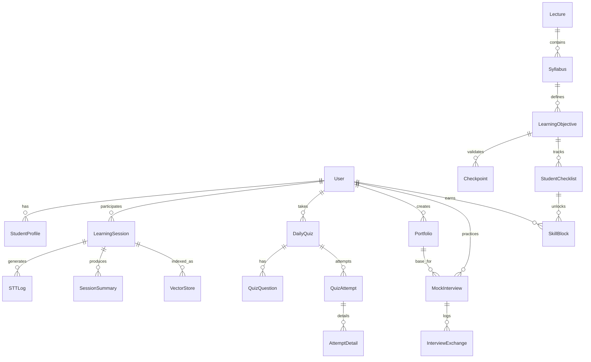

# 📊 데이터베이스 설계 (ERD & Schema)

> Re:Boot 서비스 기획(`service_specification.md`) 및 기술 스택(`tech_stack.md`)을 반영한 데이터 모델링

## 1. ERD (Entity Relationship Diagram)

---

## 2. 주요 모델 명세 (Model Specifications)

### A. Learning (학습 활동)

학생의 실시간 학습 데이터를 기록하는 코어 영역.

| Model                 | Field             | Description                   |
| :-------------------- | :---------------- | :---------------------------- |
| **`LearningSession`** | `student` (FK)    | 학습자                        |
|                       | `lecture` (FK)    | 수강 중인 강의                |
|                       | `youtube_url`     | 영상 소스 (Hybrid Mode)       |
|                       | `context_summary` | 대화 맥락 압축본 (AI Tutor용) |
| **`STTLog`**          | `session` (FK)    | 세션 참조                     |
|                       | `text_chunk`      | 실시간 자막 텍스트            |
|                       | `timestamp`       | 발화 시점                     |
| **`DailyQuiz`**       | `student` (FK)    | 응시자                        |
|                       | `total_score`     | 퀴즈 점수                     |
|                       | `is_passed`       | 통과 여부 (80점 이상)         |

### B. Curriculum (커리큘럼 구조)

강의의 뼈대와 학습 목표를 정의.

| Model                   | Field             | Description                   |
| :---------------------- | :---------------- | :---------------------------- |
| **`Lecture`**           | `title`           | 강의명                        |
|                         | `instructor` (FK) | 담당 강사                     |
| **`Syllabus`**          | `week_number`     | 주차 (Week 1, 2...)           |
|                         | `title`           | 주차별 주제                   |
| **`LearningObjective`** | `content`         | 학습 목표 (체크리스트 항목)   |
|                         | `is_checkpoint`   | **[New]** 필수 통과 지점 여부 |

### C. Assetization (자산화 & 관리) - **[New Features]**

중도 포기를 방지하고 리라우팅을 지원하기 위한 모델들.

| Model                        | Field              | Description                            |
| :--------------------------- | :----------------- | :------------------------------------- |
| **`StudentChecklist`**       | `student` (FK)     | 학습자                                 |
|                              | `objective` (FK)   | 학습 목표                              |
|                              | `is_checked`       | 달성 여부 (True/False)                 |
| **`SkillBlock`**             | `student` (FK)     | 소유자                                 |
|                              | `name`             | 스킬명 (예: React Hooks)               |
|                              | `level`            | 숙련도 (1~5)                           |
|                              | `acquired_at`      | 획득 일시                              |
|                              | `source_lecture`   | 출처 강의                              |
| **`StudentCurriculumState`** | `student` (FK)     | 학습자                                 |
|                              | `current_week`     | 현재 진행 주차                         |
|                              | `risk_level`       | 이탈 위험도 (Safe/Warning/Critical)    |
|                              | `recommended_path` | **[New]** AI 추천 리라우팅 경로 (JSON) |

### D. Career (커리어 & 결과)

학습 데이터를 바탕으로 생성된 포트폴리오 및 면접.

| Model                   | Field      | Description                    |
| :---------------------- | :--------- | :----------------------------- |
| **`Portfolio`**         | `type`     | JOB(취업) / STARTUP(창업)      |
|                         | `content`  | Markdown 포트폴리오            |
| **`MockInterview`**     | `persona`  | 면접관 페르소나 (Tech Lead 등) |
|                         | `status`   | 진행 상태                      |
| **`InterviewExchange`** | `question` | AI 질문                        |
|                         | `answer`   | 사용자 답변                    |
|                         | `feedback` | AI 피드백 및 점수              |

---

## 3. 마이그레이션 전략 (Migration Strategy)

1.  **Phase 1**: `LearningObjective`에 `is_checkpoint` 필드 추가.
2.  **Phase 2**: `SkillBlock` 및 `StudentCurriculumState` 모델 신규 생성.
3.  **Phase 3**: 기존 `StudentChecklist` 데이터를 기반으로 `SkillBlock` 초기 데이터 마이그레이션 수행.
