# Re:Boot 서비스 개발 구현 계획서 (Implementation Plan)

## 1. 프로젝트 개요

**Re:Boot**는 AI 기반의 실시간 경로 재설계 및 학습 경험 자산화를 지원하는 커리어 빌드업 플랫폼입니다.
학습자가 STT/OCR을 통해 학습에 몰입하면, AI가 쉬는 시간마다 핵심을 요약하고, 일과 종료 시 자동으로 퀴즈를 출제하여 성취도를 측정합니다. 측정된 데이터는 강사와 매니저에게 공유되어 개인화된 케어와 클래스 관리에 활용됩니다.

### 1.1 기술 스택

- **Database**: MariaDB (관계형 데이터 및 퀴즈/성취도 기록 관리)
- **Backend**: Django REST Framework (DRF) (API 서버, 권한 관리, AI 파이프라인 연동)
- **Frontend**: Vue.js 3 + Pinia + Vite (대시보드, 학습창, 리포트 UI)
- **AI Engine**: STT(Whisper), LLM(GPT-4o/Claude 3.5 Sonnet) - 요약 및 퀴즈 생성용

---

## 2. 시스템 아키텍처 및 역할 (Roles)

### 2.1 사용자 역할 정의

1.  **학습자 (Student)**: STT 학습, 요약 확인, 일일 퀴즈 풀이, 마이 부트캠프 로드맵 관리.
2.  **강사 (Instructor)**: 담당 학생들의 개별 퀴즈 결과 및 이해도(성취도) 세부 조회.
3.  **매니저 (Manager)**: 클래스(반) 전체의 평균 성취율, 수업 진도율, 이탈 위험군 모니터링.

### 2.2 AI 데이터 파이프라인 (안정성 강화)

```mermaid
graph LR
    STT[STT Stream] -->|Chunking 30s| STT_LOG[Redis/DB Temp Log]
    STT_LOG -->|Append Sequence| Preprocess[Text Consolidation]
    Preprocess -->|Break Time Trigger| Summarizer[AI Summarizer]
    Summarizer -->|Save| DB_Summary[Session Summary DB]
    DB_Summary -->|End of Day| QuizGen[AI Quiz Generator]
    QuizGen -->|Generate 5 Qs| DB_Quiz[Daily Quiz DB]
```

---

## 3. 데이터베이스 설계 (MariaDB Schema)

### 3.1 사용자 및 그룹 관리

- **User**: `id`, `username`, `role(STUDENT|INSTRUCTOR|MANAGER)`
- **ClassGroup**: `id`, `name` (예: "풀스택 3기 A반"), `manager_id`
- **Enrollment**: `student_id`, `class_group_id` (학생-반 매핑)

### 3.2 학습 및 요약 (Learning Content)

- **Course/Section**: 정규 커리큘럼 구조.
- **LearningSession (교시)**: `id`, `student_id`, `date`, `session_order`
  - 교시별 학습 로그.
- **SessionSummary (쉬는 시간 요약)**: `id`, `session_id`, `content_text` (AI 요약본)
- **[New] STT_Log (임시 저장소)**: `id`, `session_id`, `sequence_order`, `text_chunk`
  - **목적**: STT 최대 가동 시간 제한 및 브라우저 중단 대비. 30초~1분 단위로 쪼개진 텍스트를 순차 저장하여 데이터 유실 방지.

### 3.3 평가 시스템 (Assessment)

- **DailyQuiz (일일 퀴즈)**: `id`, `student_id`, `date`, `total_score`
- **QuizQuestion (문제)**: `quiz_id`, `question_text`, `options`, `correct_answer`
- **QuizAttempt (풀이 기록)**: `id`, `student_id`, `quiz_id`, `score`

---

## 4. 백엔드 API 명세 (Django DRF)

### 4.1 학습자: 학습 및 퀴즈 (Student Flow)

- **학습 세션 (실시간 Chunking 전송)**
  - `POST /api/learning/session/{id}/chunk/`: **STT 텍스트 조각 전송**. (Client는 30초마다 호출)
  - `POST /api/learning/session/{id}/summarize/`: **(쉬는 시간)** 누적된 Chunk들을 병합하여 AI 요약 요청.
- **일일 마무리**
  - `POST /api/learning/daily/finalize/`: 일일 요약 통합 및 퀴즈 생성.
  - `GET /api/assessment/daily-quiz/today/`: 퀴즈 조회.
  - `POST /api/assessment/daily-quiz/submit/`: 답안 제출.

### 4.2 강사: 성취도 확인

- `GET /api/instructor/students/`: 학생 목록.
- `GET /api/instructor/student/{student_id}/report/`: 특정 학생 성취도 상세 리포트.

### 4.3 매니저: 클래스 관리

- `GET /api/manager/class/{class_id}/dashboard/`: 클래스 종합 현황판(성취율, 진도율, 위험군).

---

## 5. STT 기술적 제약 대응 전략 (Technical Strategy)

### 5.1 STT 시간/용량 제한 해결 (Chunking Strategy)

- **문제점**: STT 엔진(Whisper API 등)과 브라우저 리소스는 장시간(1시간 이상) 연속 가동 시 연결 끊김이나 메모리 부족, API 용량 초과 오류가 발생할 수 있음.
- **해결책**:
  1.  **Client Side**: 30초~60초 단위로 오디오 버퍼를 끊어서(Slicing) 텍스트로 변환 후 서버로 즉시 전송.
  2.  **Server Side**: 전송받은 텍스트 조각(`text_chunk`)을 `STT_Log` 테이블에 순서대로(`sequence_order`) 저장.
  3.  **Aggregation**: 요약 생성 시점에 `STT_Log`의 데이터를 순서대로 이어 붙여(Concat/Append) 전체 문맥 완성 후 AI에게 전달.
- **기대 효과**: 중간에 브라우저가 종료되어도 직전까지의 기록은 안전하게 보존되며, API 제한 없이 무제한 길이의 수업 녹취 가능.

---

## 6. 개발 로드맵 (수정됨)

### 1주차: 프로젝트 세팅 및 사용자/클래스 구조

- Django 프로젝트 및 MariaDB 연동.
- User Model 확장 (Role 구분) 및 ClassGroup 모델링.
- Vue.js 레이아웃 (Student/Instructor/Manager 분기 처리).

### 2주차: STT 저장 및 요약 파이프라인 (Chunking 구현)

- [Backend] **STT 조각 수신 API** (`/chunk/`) 및 `STT_Log` 모델 구현.
- [Frontend] 오디오 스트림 Chunking 로직 및 주기적 전송 스크립트 작성.
- [AI] 조각난 텍스트 병합 및 요약 프롬프트 최적화.

### 3주차: 일일 퀴즈 생성 및 평가 시스템

- [Backend] 하루치 Summary 합산 -> 퀴즈 생성 로직.
- [Frontend] 퀴즈 풀이 UI 및 채점 시스템.

### 4주차: 강사/매니저 대시보드 및 리포트

- [Backend] 성취도/진도율 집계 쿼리 최적화.
- [Frontend] Chart.js 활용 시각화.
