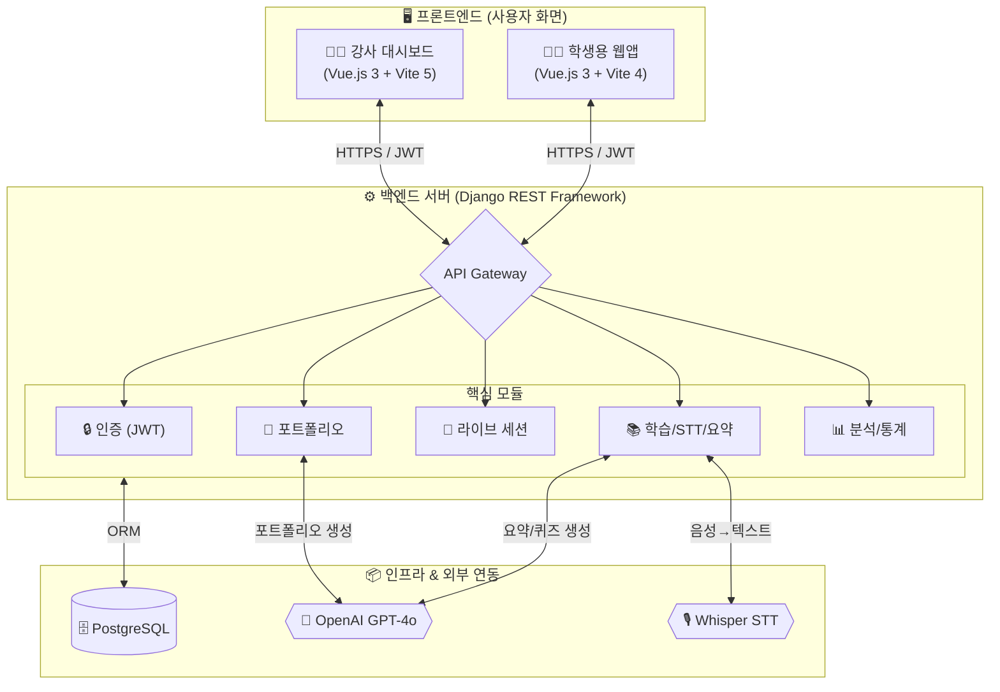
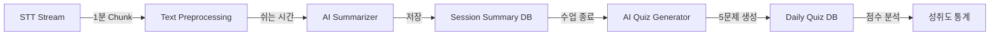

# 🚀 Re:Boot — 최종 발표 자료

> **AI 실시간 경로 재설계 및 학습 경험 자산화를 위한 커리어 빌드업 플랫폼**

---

## 📌 목차

1. [Re:Boot 소개 — Pain Point, Solution, Core Value](#1-reboot-소개)
2. [4주간의 개발 과정](#2-4주간의-개발-과정)
3. [Service Flow — Student & Instructor](#3-service-flow)
4. [라이브 데모 시나리오](#4-라이브-데모-시나리오)
5. [시스템 아키텍처 및 특장점](#5-시스템-아키텍처-및-특장점)
6. [기대 효과 및 비즈니스 임팩트](#6-기대-효과-및-비즈니스-임팩트)
7. [한계점 및 향후 계획](#7-한계점-및-향후-계획)
8. [질의응답](#8-질의응답)

---

## 1. Re:Boot 소개

### 🔥 Pain Point — 우리가 주목한 세 가지 문제

#### ① 보이지 않는 격차 (Invisible Gap)

> 커리큘럼이 요구하는 수준과 학습자의 현재 이해도 사이에는 아무도 메워주지 않는 **구조적 격차**가 존재합니다.

- 부트캠프는 빠른 속도로 진행됩니다.
- 한 번 뒤처지면 **"눈덩이처럼 불어나는 인지 부채"** 가 생깁니다.
- 강사 1명이 30명 이상의 학습자 개개인의 수준을 실시간으로 파악하는 것은 **물리적으로 불가능**합니다.

#### ② 필기의 역설 (Note-Taking Paradox)

> 놓치지 않으려 필기하다가, 정작 중요한 설명을 듣지 못하는 **"주객전도"** 현상.

- 학습자는 강의 중 **필기**와 **이해** 사이에서 끊임없이 갈등합니다.
- 필기에 집중하면 핵심 설명을 놓치고, 경청에 집중하면 기록이 남지 않습니다.
- 이는 단순한 불편이 아닌, 학습 효율을 **구조적으로 저해**하는 근본 문제입니다.

#### ③ 중도 포기의 낙인 (All or Nothing)

> 90%를 수강해도 10%를 못 채우면 **"미수료"**, 즉 **"실패"** 로 규정됩니다.

- 현행 교육 시스템은 **"수료 or 미수료"** 의 이분법적 평가 구조입니다.
- 중도 이탈 시, 그간 쌓아온 모든 학습 경험이 **"실패"** 라는 한 단어로 증발합니다.
- 이는 학습자의 **자기효능감 붕괴**와 재도전 의지 상실로 직결됩니다.
- 국비 지원 교육의 경우, **정부 예산 환수 리스크**까지 발생합니다.

---

### 💡 Solution — Re:Boot의 핵심 솔루션

#### Solution 1. 몰입형 AI 학습 비서 (Focus-First)

> **"필기는 AI에게 맡기고, 당신은 이해에만 집중하세요."**

| 기능                  | 설명                                                                                                  |
| :-------------------- | :---------------------------------------------------------------------------------------------------- |
| **실시간 AI 노트**    | 강의 음성을 STT(Speech-to-Text)로 변환 → AI가 잡담을 필터링하고 **핵심만 구조화된 노트로 자동 생성**  |
| **문맥 인식 AI 튜터** | "아까 선생님이 말한 그 예시 다시 설명해줘"가 통하는, **오늘 수업 내용을 기억하는** AI 조교 (RAG 기술) |
| **IP 보호 & 상생**    | 강사의 **원본 음성은 저장하지 않고**, 2차 가공된 요약 노트만 제공 → 지적재산권 이슈 **원천 차단**     |

#### Solution 2. 데이터 기반 다이내믹 리라우팅 (Dynamic Re-routing)

> **"경로를 이탈하셨습니까? 목적지까지 가장 빠른 새 경로를 안내합니다."**

- **정적 진도표 NO**: 정해진 스케줄을 강요하지 않습니다.
- **실시간 재설계**: 3일간 결석하거나 퀴즈 점수가 낮으면, 남은 기간 내 목표 달성을 위한 **"압축 패스트 트랙"** 으로 커리큘럼을 즉시 수정 제안합니다.
- **골든타임 알림**: 학습 부진 징후 포착 시 **보충 강의 + 3분 요약 노트**를 팝업으로 제공합니다.

#### Solution 3. 학습 경험의 자산화 (Assetization)

> **"중도 포기는 없습니다. 부분적 성취가 있을 뿐입니다."**

- **스킬 블록 (Skill-Block)**: 완강을 못 해도, 학습한 구간만큼은 **디지털 자산**으로 보존됩니다.
- **듀얼 아웃풋 포트폴리오**:
  - 🎯 **취업 모드**: 학습 로그 기반 → 역량 증빙용 **데이터 포트폴리오** 자동 생성
  - 🚀 **창업 모드**: 습득 기술 기반 → **MVP 기획서 및 기술 명세서** 자동 생성

---

### 🏆 Core Value — 차별화 포인트

| 구분          | 기존 LMS/커뮤니티                      | **Re:Boot**                                       |
| :------------ | :------------------------------------- | :------------------------------------------------ |
| **진도 관리** | 정적 관리 (미수강 시 심리적 부채 발생) | **동적 리라우팅** (현재 시점 최적 경로 재설계)    |
| **학습 지원** | 소통/Q&A 위주                          | **인지 부하 해소** (AI 자동 요약 & 구조화 노트)   |
| **성취 정의** | 수료증 (All or Nothing)                | **스킬 블록** (부분적 성취의 데이터 자산화)       |
| **아웃풋**    | 단순 수료증                            | **커리어 직결** (포트폴리오/MVP 기획서 자동 생성) |
| **강사 관계** | 리소스 소모형 (단순 반복 Q&A)          | **상생형 데이터 피드백** (강의 개선 인사이트)     |

> 💬 **비즈니스 핵심 메시지**
> _"Re:Boot는 '무엇을 가르칠 것인가'를 고민하는 기존 LMS 시장에서, **'어떻게 끝까지 완주시키고 자산화할 것인가'** 를 데이터로 해결하는 유일한 커리어 빌드업 솔루션입니다."_

---

## 2. 4주간의 개발 과정

### 📅 전체 타임라인

```
Week 1-2   ███████████░░░░░░░░░  기반 구축 & 핵심 AI 파이프라인
Week 3     ██████████████░░░░░░  학습 안정성 & 데이터 정합성
Week 4     ████████████████████  통계 대시보드 & 배포 최적화
```

### 🗓️ Week 1~2: 기반 구축 및 핵심 AI 파이프라인

> **"서비스의 심장을 만드는 시간"**

| 완료 항목           | 상세 내용                                           |
| :------------------ | :-------------------------------------------------- |
| **프로젝트 세팅**   | Django + PostgreSQL + Vue.js 3 연동                 |
| **사용자 인증**     | JWT(SimpleJWT) 기반 인증 시스템 구축                |
| **역할 분기**       | Student / Instructor / Manager 3-Tier 아키텍처 설계 |
| **STT 파이프라인**  | Whisper API + Chunking(1분 단위 이어달리기) 구현    |
| **AI 요약 엔진**    | OpenAI GPT-4o 연동 → 쉬는 시간 요약 생성            |
| **퀴즈 자동 생성**  | 학습 요약 기반 5문제 데일리 퀴즈 생성               |
| **하이브리드 학습** | 오프라인/유튜브/범용(DisplayMedia) 3모드 지원       |
| **Apple-style UI**  | Glassmorphism + Dark Mode 디자인 시스템 적용        |

**⚡ 기술적 도전 & 해결:**

- **STT 25MB 제한** → Chunking 패턴으로 장시간 가동 안정화
- **문장 미완성 전송** → Sentence Buffering(한국어 어미 검출) 로직 구현
- **Whisper Hallucination** → 다층 필터링(Prompt Echo + 반복 음절 + 알파 비율) 적용

### 🗓️ Week 3: 학습 안정성 및 데이터 정합성 강화

> **"서비스가 진짜 현장에서 살아남을 수 있도록"**

| 완료 항목               | 상세 내용                                                   |
| :---------------------- | :---------------------------------------------------------- |
| **세션 복구**           | 브라우저 새로고침 시 `localStorage` 기반 자동 복구          |
| **Backend-as-Truth**    | 프론트엔드 휘발성 데이터 → 서버 중심 진실 모델로 전환       |
| **URL 정규화**          | Django URLField strict validation 대응 → 자동 프로토콜 보정 |
| **AI 예외 처리**        | 400(데이터 없음) vs 500(서버 오류) 분기 처리 강화           |
| **프로그레시브 피드백** | AI 생성 대기 중 로딩 오버레이 적용 (사용자 불안 해소)       |

### 🗓️ Week 4: 포트폴리오, 강사 대시보드 및 배포

> **"최종 아웃풋과 실전 배포"**

| 완료 항목             | 상세 내용                                  |
| :-------------------- | :----------------------------------------- |
| **커리어 포트폴리오** | 취업/창업 듀얼 모드 + AI 리포트 자동 생성  |
| **강사 대시보드**     | 독립 Vue 프로젝트 + Chart.js 성취도 시각화 |
| **입장 코드 시스템**  | 6자리 Access Code로 분산형 수강 등록       |
| **Syllabus 관리**     | 인라인 편집 + 교안 파일 업로드 기능        |
| **OCI 배포**          | Nginx + tar.gz 아토믹 배포 전략            |
| **보안 강화**         | Vue Router Guard + 404 커스텀 뷰 + RBAC    |
| **라이브 세션**       | 실시간 STT 피드 + Pulse(이해도 피드백)     |

---

## 3. Service Flow

### 👩‍🎓 Student Flow (학습자 흐름)

```
┌─────────────────────────────────────────────────────────────────────┐
│                        학습자 여정 (Student Journey)                  │
├─────────────────────────────────────────────────────────────────────┤
│                                                                     │
│  [1] 회원가입/로그인    JWT 인증 → Pinia 글로벌 상태 관리            │
│         ↓                                                           │
│  [2] 레벨 테스트        AI 기반 현재 수준 진단 → 맞춤 로드맵 생성    │
│         ↓                                                           │
│  [3] 학습 모드 선택                                                  │
│      ┌──────────────┬──────────────┬──────────────┐                 │
│      │ 🏫 클래스 참여 │ 🎤 현장 강의  │ 📺 유튜브 학습 │                │
│      │ (입장코드 입력)│ (마이크 녹음) │ (URL 입력)    │                │
│      └──────┬───────┴──────┬───────┴──────┬───────┘                │
│             └──────────────┼──────────────┘                         │
│                            ↓                                        │
│  [4] 실시간 학습          STT 실시간 자막 생성                       │
│         ↓                 AI 자동 요약 노트 생성                     │
│         ↓                 개인 메모 작성 가능                        │
│                                                                     │
│  [5] 학습 완료 판정                                                  │
│      ┌──────────────────┬──────────────────┐                        │
│      │ ✅ 완료 (≥80%)    │ ⚠️ 중단 (<80%)    │                       │
│      │ → AI 요약 자동생성│ → 부분 자산화      │                       │
│      │ → 데일리 퀴즈 제공│ → 미니 퀴즈 제안   │                       │
│      └──────────────────┴──────────────────┘                        │
│                            ↓                                        │
│  [6] 대시보드/포트폴리오   성취도 시각화 + 스킬블록 자산화            │
│                            취업/창업 모드 포트폴리오 생성              │
│                                                                     │
└─────────────────────────────────────────────────────────────────────┘
```

### 👨‍🏫 Instructor Flow (강사 흐름)

```
┌─────────────────────────────────────────────────────────────────────┐
│                        강사 여정 (Instructor Journey)                 │
├─────────────────────────────────────────────────────────────────────┤
│                                                                     │
│  [1] 강사 로그인         role=INSTRUCTOR → 전용 대시보드 진입         │
│         ↓                                                           │
│  [2] 강의(클래스) 생성   강의명 입력 → 6자리 Access Code 자동 발급    │
│         ↓                                                           │
│  [3] 커리큘럼 관리                                                   │
│      ├─ 📋 실라버스 주차별 편집 (인라인 Edit-on-Blur)                 │
│      ├─ 🎯 학습 목표 관리 (체크리스트 형태)                           │
│      └─ 📤 교안 파일 업로드 (PDF/PPT 등)                             │
│         ↓                                                           │
│  [4] 라이브 세션 진행                                                │
│      ├─ 🟢 세션 시작 → STT 실시간 피드 전송                          │
│      ├─ 💬 학생 Pulse 수신 (이해/질문/반복요청)                       │
│      └─ 🔴 세션 종료 → 자동 요약 & 참여자 통계                       │
│         ↓                                                           │
│  [5] 성취도 모니터링                                                 │
│      ├─ 📊 학생별 퀴즈 평균 점수 (Bar Chart)                         │
│      ├─ 📈 전체 진도율 및 이탈 위험군 식별                            │
│      └─ 🔍 개별 학생 상세 리포트 조회                                 │
│                                                                     │
└─────────────────────────────────────────────────────────────────────┘
```

---

## 4. 라이브 데모 시나리오

### 🎬 Scene 1: 압도적인 몰입 환경 — "수업이 곧 노트"

**[시연 포인트]**

1. 학생이 로그인 후 **"유튜브 학습"** 모드를 선택합니다.
2. 유튜브 URL을 입력하고 **"학습 시작"** 버튼을 클릭합니다.
3. 영상이 **자동 재생(Auto-Play)** 되며, 화면 우측에 **실시간 자막**이 흐릅니다.
4. 영상 종료 시 → **자동 녹음 중지** → **AI 요약 노트 즉시 생성** → 요약 탭 자동 전환
5. 생성된 AI 노트를 **PDF로 내보내기** (브라우저 네이티브 인쇄)

> 💡 **핵심 메시지**: "학생은 버튼 하나만 누르면, 나머지는 AI가 알아서 합니다."

### 🎬 Scene 2: AI 튜터와의 대화 — "오늘 수업을 기억하는 조교"

**[시연 포인트]**

1. 학습 완료 후, **데일리 퀴즈** 5문제가 AI에 의해 자동 생성됩니다.
2. 퀴즈를 풀면 **즉각적인 채점 + 해설**이 제공됩니다.
3. AI 튜터에게 "방금 틀린 문제, 쉽게 다시 설명해줘"라고 질문합니다.
4. AI가 **오늘 수업 내용 범위 내에서만** 정확하게 답변합니다 (Hallucination 방지).

> 💡 **핵심 메시지**: "수업 범위 밖의 환각(Hallucination)은 없습니다. Source-as-Truth RAG 기술 적용."

### 🎬 Scene 3: 강사 대시보드 — "데이터로 학생을 케어하다"

**[시연 포인트]**

1. 강사가 로그인하면 **자신의 강의 목록**이 표시됩니다.
2. 강의를 클릭하면 **학생별 퀴즈 평균 점수** 차트가 나타납니다.
3. **입장 코드(Access Code)** 를 원클릭으로 복사하여 학생에게 공유합니다.
4. **실라버스**를 인라인 편집하고, 교안 파일을 업로드합니다.

> 💡 **핵심 메시지**: "강사는 데이터를 보고 판단하고, 반복 Q&A는 AI에게 맡깁니다."

### 🎬 Scene 4: 포트폴리오 자동 생성 — "학습의 결실"

**[시연 포인트]**

1. 학생이 **포트폴리오** 메뉴에 진입합니다.
2. **"취업용"** 또는 **"창업용"** 버튼을 클릭하면, AI가 모든 학습 데이터를 종합하여 리포트를 생성합니다.
3. 취업용: 역량 키워드 + 프로젝트 요약 + 자기소개서 초안
4. 창업용: 서비스 아이디어 + 기술 스택 명세 + 4주 개발 로드맵

> 💡 **핵심 메시지**: "중도 포기도, 완강도, 모두 '데이터 자산'이 됩니다."

---

## 5. 시스템 아키텍처 및 특장점

### 🏗️ 전체 시스템 아키텍처



### 🔧 기술 스택 상세

| 계층          | 기술                       | 선택 이유                                     |
| :------------ | :------------------------- | :-------------------------------------------- |
| **Frontend**  | Vue.js 3 + Composition API | 반응형 UI + 코드 분할 용이                    |
| **상태 관리** | Pinia                      | Vue 3 공식 상태 관리 → 인증/학습 상태 동기화  |
| **스타일**    | SCSS + Glassmorphism       | Apple 스타일의 프리미엄 UX                    |
| **차트**      | Chart.js / vue-chartjs     | 성취도 시각화 (강사 대시보드)                 |
| **Backend**   | Django REST Framework      | 신속한 API 개발 + 강력한 ORM                  |
| **인증**      | SimpleJWT + RBAC           | 역할별 접근 제어 (Student/Instructor/Manager) |
| **AI**        | OpenAI Whisper + GPT-4o    | 산업 최고 수준의 STT + NLU                    |
| **DB**        | PostgreSQL                 | 안정적인 RDBMS + JSON 필드 지원               |
| **배포**      | OCI + Nginx + HTTPS        | tar.gz 아토믹 배포로 무중단 업데이트          |

### ⭐ 핵심 기술 특장점

#### 1. STT Engine v3 — Sentence Buffering & Hallucination Suppression

```
음성 입력 → [Whisper STT] → [Sentence Buffer] → [Hallucination Filter] → DB 저장
                                    ↓                       ↓
                            한국어 어미 검출           다층 필터링:
                            (~다, ~요, ~니다)        - Prompt Echo 차단
                            미완성 시 캐시 유지       - 뉴스/자막 환각 제거
                                                     - 반복 음절 필터 (아아아)
                                                     - 알파 비율 체크 (<20%)
```

#### 2. AI Learning Pipeline — 데이터 흐름



#### 3. 분산형 수강 등록 — Access Code 시스템

- 강사가 강의 생성 시, 6자리 **고유 Access Code** 자동 발급
- 학생은 코드 입력만으로 즉시 수강 등록 → **관리자 개입 ZERO**
- 오프라인 수업 현장에서 즉시 공유 가능 (빔 프로젝터에 띄우기)

#### 4. YouTube 자동화 학습 플로우

```
URL 입력 → 학습시작 → Auto-Play → 실시간 STT → 영상종료 감지
    → Auto-Stop → AI 요약 생성 → 요약 탭 자동 전환 → 퀴즈 제공
```

- 학생이 **버튼 1번**만 누르면, 나머지는 전부 자동화
- YouTube IFrame Player API `onStateChange` 이벤트 활용

---

## 6. 기대 효과 및 비즈니스 임팩트

### 📊 정량적 기대 효과

| 지표                 | AS-IS (기존)          | TO-BE (Re:Boot 적용 후) | 기대 개선      |
| :------------------- | :-------------------- | :---------------------- | :------------- |
| **학습 몰입 시간**   | 강의 시간의 ~60%      | 강의 시간의 ~95%        | **+58%**       |
| **중도 탈락률**      | 부트캠프 평균 30~40%  | 목표 15% 이하           | **-50% 이상**  |
| **학습 기록 활용률** | 수료증 1장            | 스킬블록 + 포트폴리오   | **∞ (자산화)** |
| **강사 학생 관리**   | 수기 출석/감각적 판단 | 데이터 기반 대시보드    | **정량화**     |

### 💰 비즈니스 모델

| 모델          | 대상                     | 수익원                                                      |
| :------------ | :----------------------- | :---------------------------------------------------------- |
| **B2G / B2B** | 국비 교육기관 / 부트캠프 | 중도 탈락 방지 솔루션 라이선스 (정부 예산 환수 리스크 관리) |
| **B2C**       | 개인 학습자              | 프리미엄 구독 (AI 튜터 + 포트폴리오 생성)                   |
| **HR 연계**   | 기업 채용부서            | 검증된 학습 로그 기반 인재 매칭 수수료                      |

### 🌍 사회적 가치

- **학습자**: "막막함"이라는 인지적 장벽 해소 → 중도 포기 시에도 **데이터 자산이 남는다는 확신**
- **교육 운영사 & 강사**: IP 보호 + 학습 데이터 확보 → **강의 질 개선 & 이탈률 감소**
- **사회 전체**: 실패로 규정되던 경험을 **"축적된 데이터"** 로 전환 → **재도전이 용이한 교육 생태계**

---

## 7. 한계점 및 향후 계획

### ⚠️ 현재 한계점

| 구분                  | 한계                            | 원인                          | 영향도  |
| :-------------------- | :------------------------------ | :---------------------------- | :------ |
| **실시간 처리**       | STT 변환 시 3~5초 지연          | Whisper API 네트워크 레이턴시 | 🟡 중   |
| **오프라인 지원**     | 인터넷 없이는 AI 기능 사용 불가 | 클라우드 기반 AI 의존         | 🟡 중   |
| **동시 접속**         | 대규모 동시 접속 미검증         | MVP 단계 인프라               | 🔴 높음 |
| **모바일**            | 현재 웹 전용 (반응형 미완성)    | 개발 기간 제약                | 🟡 중   |
| **비동기 처리**       | Celery 미적용                   | 개발 우선순위 조정            | 🟢 낮음 |
| **리라우팅 알고리즘** | 규칙 기반 (ML 미적용)           | 학습 데이터 부족              | 🟡 중   |

### 🗺️ 향후 로드맵

#### Phase 1: 안정화 (1~2개월)

- [ ] 모바일 반응형 UI 완성
- [ ] Celery + Redis 비동기 처리 도입
- [ ] 부하 테스트 및 인프라 스케일링

#### Phase 2: 고도화 (3~6개월)

- [ ] 네이티브 모바일 앱 (React Native / Flutter)
- [ ] ML 기반 리라우팅 알고리즘 (학습 패턴 분석)
- [ ] 웹소켓 기반 실시간 라이브 세션 고도화
- [ ] 온디바이스 STT (Whisper.cpp) 적용으로 오프라인 지원

#### Phase 3: 확장 (6~12개월)

- [ ] B2B SaaS 모델로 전환 (멀티 테넌트 아키텍처)
- [ ] HR 플랫폼 연동 (채용 연계 API)
- [ ] 다국어 지원 (글로벌 확장)
- [ ] 학습 데이터 기반 교육과정 추천 엔진

---

## 8. 질의응답

### 🙋 예상 질문 & 답변 준비

#### Q1. "기존 LMS (Canvas, Moodle 등)와 어떻게 다른가요?"

> 기존 LMS는 **"콘텐츠 전달과 관리"** 에 초점이 맞춰져 있습니다. Re:Boot는 **"학습자가 끝까지 완주하도록 AI가 동반하는 것"** 에 초점을 둡니다. 실시간 AI 노트, 다이내믹 리라우팅, 스킬 블록 자산화는 기존 LMS에 없는 기능입니다.

#### Q2. "강사의 지적재산권(IP) 문제는 어떻게 해결했나요?"

> 강사의 **원본 음성을 저장하지 않습니다.** STT로 변환된 텍스트를 AI가 재구성한 **"2차 저작물 형태의 요약 노트"** 만 제공합니다. 원본과 동일한 콘텐츠를 재현할 수 없는 구조입니다.

#### Q3. "STT 정확도는 어느 정도인가요?"

> OpenAI Whisper 기반으로, 깨끗한 음성 환경에서 **95% 이상의 정확도**를 보입니다. 추가로 자체 개발한 **Sentence Buffering**(문장 완성 검증)과 **Hallucination Suppression**(환각 필터)을 적용하여, 교육 환경에서의 잡음과 부정확한 변환을 최소화했습니다.

#### Q4. "수익 모델이 지속 가능한가요?"

> **3-layer 수익 구조**를 설계했습니다:
>
> 1. **B2G/B2B**: 국비 기관/부트캠프에 SaaS 라이선스 제공 (중도 탈락 방지 → 정부 보조금 환수 리스크 해결)
> 2. **B2C**: 개인 구독 (프리미엄 AI 기능)
> 3. **HR 연계**: 검증된 학습 데이터 기반 인재 매칭 수수료

#### Q5. "4주 만에 이 모든 걸 어떻게 만들었나요?"

> 핵심은 **"AI 파이프라인 우선 전략"** 입니다. UI 완성도보다 **STT → 요약 → 퀴즈 → 포트폴리오**의 핵심 데이터 흐름을 먼저 관통시킨 뒤, 위에 UI를 입혔습니다. 또한 Vue.js와 Django의 빠른 프로토타이핑 능력, 그리고 OpenAI API의 범용성이 속도의 핵심이었습니다.

---

> ### 🎤 Closing Message
>
> **"Re:Boot는 당신의 노력이 단 1%도 증발하지 않도록 지켜주는, 가장 든든한 파트너가 되겠습니다."**
>
> 감사합니다. 🙏

---

_© 2026 Re:Boot Team. All Rights Reserved._
